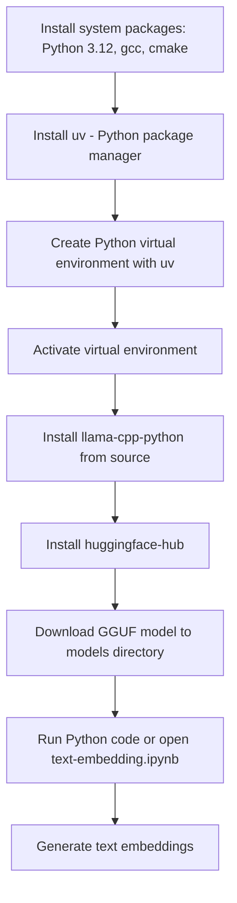

# Run Lightweight Text Embedding Models Locally with Llama.cpp on Red Hat Linux

**A simple setup to run GGUF embedding models like IBM’s Granite locally using llama.cpp — no GPU required.**

Set up `llama-cpp-python` on Red Hat Linux 9.4, build it from source, and use a quantized GGUF model to generate text embeddings. This guide uses [`uv`](https://github.com/astral-sh/uv) for lightweight and reproducible Python environment management.

A sample notebook, [`text-embedding.ipynb`](./text-embedding.ipynb), is included to demonstrate end-to-end usage.

---

## Quick Start (Recommended)

If you just want to get started quickly:

1. **Run the setup script**

   ```bash
   ./setup.sh
   ```

   * Installs system packages and Python dependencies
   * Creates a virtual environment with `uv`
   * Builds and installs `llama-cpp-python` from source
   * Downloads the embedding model

2. **Run the VS Code config script** (optional but recommended if using VS Code)

   ```bash
   ./vscode-config.sh
   ```

   * Sets the current `.venv` as the Python interpreter for VS Code
   * Ensures the notebook uses the correct interpreter

3. **Open and run the notebook**

   ```bash
   text-embedding.ipynb
   ```

   * Demonstrates how to load a local GGUF model
   * Shows how to generate embeddings from sample text

> That’s it. Everything should work out of the box.

For a deeper understanding, continue with the step-by-step instructions below.

---

## Overview

You will:

* Set up a Python 3.12 development environment on RHEL
* Build `llama-cpp-python` from source
* Use `uv` to manage your Python virtual environment
* Download a quantized embedding model (GGUF)
* Generate embeddings from input text using Llama.cpp

---

## Workflow



---

## System Requirements

* Red Hat Enterprise Linux 9+ or compatible (Rocky, Alma, CentOS Stream)
* Python 3.12 (plus `python3.12-devel`)
* Build tools: `gcc`, `cmake`, `make`, `libcurl-devel`
* At least 4–6 GB of system memory

Tested on Red Hat Linux 9.4 with Python 3.12.

---

## Install System Packages

If needed, enable CodeReady Builder:

```bash
sudo subscription-manager repos --enable codeready-builder-for-rhel-9-$(arch)-rpms
```

Then install required packages:

```bash
sudo dnf install -y python3.12 python3.12-devel gcc-c++ make cmake libcurl-devel wget
```

---

## Install `uv` (Python package manager)

```bash
curl -LsSf https://astral.sh/uv/install.sh | sh
uv --version
```

---

## Set Up Python Environment

```bash
uv venv --python $(which python3.12)
source .venv/bin/activate
```

---

## Install Python Packages from Source

The following ensures `llama-cpp-python` builds using your local C++ toolchain (CMake, gcc):

```bash
export LLAMA_CPP_CMAKE_ARGS="-DLLAMA_NATIVE=ON"
uv pip install llama-cpp-python --no-binary :all:
uv pip install huggingface-hub
```

---

## Download the GGUF Model

```bash
mkdir -p models
cd models

wget -O granite-embedding-30m-english-Q6_K.gguf \
  https://huggingface.co/lmstudio-community/granite-embedding-30m-english-GGUF/resolve/main/granite-embedding-30m-english-Q6_K.gguf

cd ..
```

Model source: [Hugging Face – granite-embedding-30m-english](https://huggingface.co/lmstudio-community/granite-embedding-30m-english-GGUF)

---

## Example: Generate Text Embeddings

See [`text-embedding.ipynb`](./text-embedding.ipynb) for a complete walkthrough.

```python
from llama_cpp import Llama

llm = Llama(
    model_path="models/granite-embedding-30m-english-Q6_K.gguf",
    embedding=True,
    verbose=False
)

embedding = llm.create_embedding("Hello, world!")
vector = embedding['data'][0]['embedding']
print(vector[:12], "...")
```

---

## Notes

* This setup builds the `llama.cpp` C++ backend directly from source.
* The `.gguf` model used is optimized for text embedding tasks only.
* You can replace the model with any GGUF-compatible embedding model from Hugging Face.
* `uv` simplifies reproducible Python environments and speeds up installation.
* This guide assumes a CPU-only environment. No GPU or CUDA is required.
