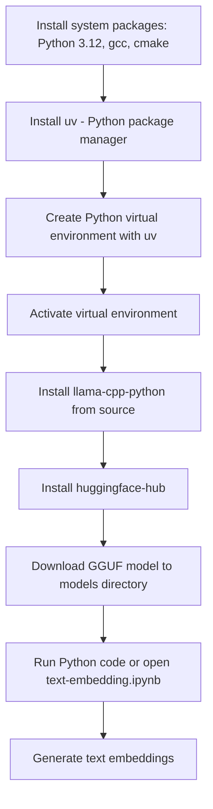

# Generate Text Embeddings Using Llama.cpp and GGUF Models on Red Hat Linux

A beginner-friendly walkthrough for generating text embeddings using a lightweight LLM model, built from source with `llama-cpp-python`. Tested on Red Hat Linux 9.4 with Python 3.12.

---

## 🔧 Quick Start (Shortcut)

If you want to skip the detailed setup steps, you can get everything working in just two commands:

1. Run the setup script to install dependencies, create a virtual environment, and download the model:
   ```bash
   ./setup.sh
````

2. Run the VS Code configuration script (optional, for VS Code users):

   ```bash
   ./vscode-config.sh
   ```

3. Open the notebook:

   ```bash
   code text-embedding.ipynb
   ```

This sets up everything needed to explore the embedding model directly in the notebook.

---

## What This Does

You will:

* Set up a Python 3.12 development environment on Red Hat Linux
* Build and install `llama-cpp-python` from source
* Use `uv` to manage Python packages
* Download a GGUF text embedding model from Hugging Face
* Run a notebook that generates and explores text embeddings

---

## Workflow



---

## System Requirements

* Red Hat Enterprise Linux 9.4 (or compatible, e.g., Rocky/Alma/CentOS Stream)
* Python 3.12 (plus `python3.12-devel`)
* Build tools: `gcc`, `cmake`, `make`, `libcurl-devel`
* 4–6 GB RAM recommended

---

## Install System Packages

Enable CodeReady Builder (if needed):

```bash
sudo subscription-manager repos --enable codeready-builder-for-rhel-9-$(arch)-rpms
```

Install system dependencies:

```bash
sudo dnf install -y python3.12 python3.12-devel gcc-c++ make cmake libcurl-devel wget
```

---

## Install `uv` and Create Virtual Environment

```bash
curl -LsSf https://astral.sh/uv/install.sh | sh
export PATH="$HOME/.local/bin:$PATH"
uv venv --python $(which python3.12)
source .venv/bin/activate
```

---

## Install Python Packages from Source

```bash
export LLAMA_CPP_CMAKE_ARGS="-DLLAMA_NATIVE=ON"
uv pip install llama-cpp-python --no-binary :all:
uv pip install huggingface-hub
```

To install any additional dependencies:

```bash
uv pip install -r requirements.txt
```

---

## Download a GGUF Text Embedding Model

```bash
mkdir -p models
cd models
wget -O granite-embedding-30m-english-Q6_K.gguf \
  https://huggingface.co/lmstudio-community/granite-embedding-30m-english-GGUF/resolve/main/granite-embedding-30m-english-Q6_K.gguf
cd ..
```

---

## Run the Example Notebook

Open the notebook with VS Code or Jupyter:

```bash
code text-embedding.ipynb
```

This notebook loads the local GGUF model and shows how to convert text into vector embeddings using `llama-cpp-python`.

---

## Load the Embedding Model from Local File

* Pre-downloaded `text-embedding` model in GGUF format from Hugging Face
* `granite-embedding-30m-english` by IBM, optimized for lightweight embedding tasks
* Stored in the `models/` directory (no runtime download needed)
* Converts text into vector embeddings (numeric representations of meaning)
* You can swap this with any GGUF-compatible embedding model from Hugging Face
  ([see step-by-step guide](https://shaikhonai.substack.com/i/162148895/select-and-download-a-gguf-model))

---

## Resources

* [Llama.cpp GitHub repository](https://github.com/ggerganov/llama.cpp)
* [llama-cpp-python documentation](https://llama-cpp-python.readthedocs.io/)
* [Hugging Face: GGUF-compatible models](https://huggingface.co/models?library=llama-cpp)
* [Text Embedding with GGUF Models (Step-by-Step)](https://shaikhonai.substack.com/i/162148895/select-and-download-a-gguf-model)`
