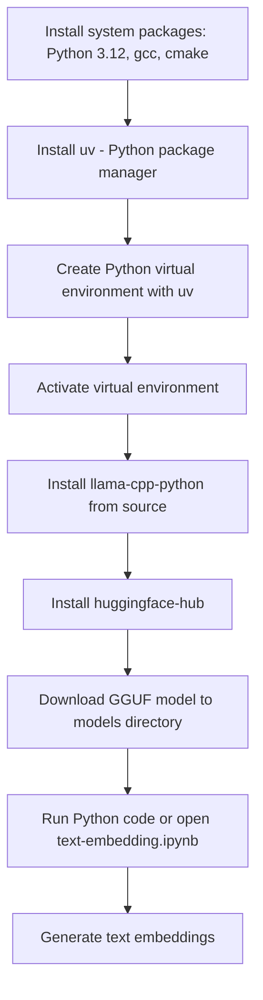

# Generate Text Embeddings with Llama.cpp on Red Hat Linux (from Source)

Set up `llama-cpp-python` on Red Hat Linux, build it from source, and use a quantized GGUF model to generate text embeddings. This guide uses `uv` for lightweight and reproducible Python environment management.

---

## Overview

You will:

- Set up a development environment on RHEL
- Build `llama-cpp-python` from source
- Create a Python virtual environment using `uv`
- Download a quantized text embedding model (GGUF)
- Generate embeddings from input text

A sample notebook, [`text-embedding.ipynb`](./text-embedding.ipynb), is included to demonstrate end-to-end usage.

---

## Setup Workflow

## Setup Workflow

## Setup Workflow

## Setup Workflow



---

## System Requirements

- Red Hat Enterprise Linux or compatible
- Python 3.12
- Development tools: `cmake`, `gcc`, `make`, `libcurl-devel`, `python3.12-devel`
- At least 4–6 GB of memory

---

## Install System Packages

```bash
sudo dnf install python3.12 cmake gcc-c++ make libcurl-devel
sudo dnf install python3.12-devel
```

---

## Install `uv` (Python package manager)

```bash
curl -LsSf https://astral.sh/uv/install.sh | sh
uv --version
```

---

## Set Up Python Environment

```bash
uv venv --python $(which python3.12)
source .venv/bin/activate
```

---

## Install Python Packages from Source

```bash
uv pip install llama-cpp-python --no-binary :all:
uv pip install huggingface-hub
```

---

## Download the Model

```bash
mkdir models
cd models
wget https://huggingface.co/phate334/multilingual-e5-large-gguf/resolve/main/multilingual-e5-large-q4_k_m.gguf
ls -lh multilingual-e5-large-q4_k_m.gguf
```

Model source: [Hugging Face – multilingual-e5-large-gguf](https://huggingface.co/phate334/multilingual-e5-large-gguf)

---

## Example: Generate Text Embeddings

See [`text-embedding.ipynb`](./text-embedding.ipynb) for a full example. Below is a minimal preview:

```python
from llama_cpp import Llama

llm = Llama(
    model_path="models/multilingual-e5-large-q4_k_m.gguf",
    embedding=True,
    verbose=False
)

embedding = llm.create_embedding("Hello, world!")
vector = embedding['data'][0]['embedding']
print(vector)
```

---

## Notes

- This setup builds `llama-cpp-python` and its C++ backend directly from source.
- The GGUF model used is optimized for text embedding tasks only.
- `uv` simplifies dependency isolation and speeds up installation.

