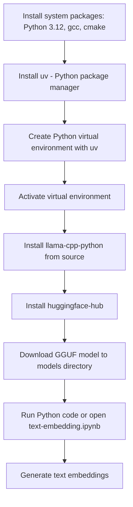

# Run Local Text Embeddings with Llama.cpp on Red Hat Linux

*A lightweight, CPU-only setup to generate vector embeddings from text using GGUF models with Llama.cpp and Python. No GPU or external API required.*

This example walks you through setting up `llama-cpp-python` from source on Red Hat Linux 9.4 using only CPU. You'll run local inference using the `granite-embedding-30m-english` model from IBM, pre-downloaded in GGUF format. You can easily replace it with any other GGUF-compatible embedding model from [Hugging Face](https://huggingface.co).

A sample notebook, [`text-embedding.ipynb`](./text-embedding.ipynb), is included for hands-on exploration.

---

## Quick Start

To get started quickly:

1. Run the setup script:

   ```bash
   ./setup.sh
   ```

   This installs dependencies, creates a virtual environment, installs packages, and downloads the model.

2. Configure VS Code to use the new Python interpreter:

   ```bash
   ./configure-vscode.sh
   ```

   This sets the Python interpreter for the workspace and notebook.

3. Open and run [`text-embedding.ipynb`](./text-embedding.ipynb) to generate embeddings.

You can find more detailed explanations of each step in the sections below.

---

## Overview

You will:

* Set up a Python 3.12 development environment on RHEL
* Build `llama-cpp-python` from source
* Use `uv` to manage your Python virtual environment
* Download a quantized embedding model (GGUF)
* Generate embeddings from input text using Llama.cpp

---

## Workflow



---

## System Requirements

* Tested on Red Hat Enterprise Linux 9.4
* Python 3.12 (plus `python3.12-devel`)
* Build tools: `gcc`, `cmake`, `make`, `libcurl-devel`
* At least 4–6 GB of system memory

---

## Install System Packages

If needed, enable CodeReady Builder:

```bash
sudo subscription-manager repos --enable codeready-builder-for-rhel-9-$(arch)-rpms
```

Then install required packages:

```bash
sudo dnf install -y python3.12 python3.12-devel gcc-c++ make cmake libcurl-devel wget
```

---

## Install `uv` (Python package manager)

```bash
curl -LsSf https://astral.sh/uv/install.sh | sh
uv --version
```

---

## Set Up Python Environment

```bash
uv venv --python $(which python3.12)
source .venv/bin/activate
```

---

## Install Python Packages from Source

The following ensures `llama-cpp-python` builds using your local C++ toolchain (CMake, gcc):

```bash
export LLAMA_CPP_CMAKE_ARGS="-DLLAMA_NATIVE=ON"
uv pip install llama-cpp-python --no-binary :all:
uv pip install huggingface-hub
```

---

## Install from `requirements.txt` (optional)

If a `requirements.txt` file exists, install dependencies:

```bash
uv pip install -r requirements.txt
```

---

## Download the GGUF Model

```bash
mkdir -p models
cd models

wget -O granite-embedding-30m-english-Q6_K.gguf \
  https://huggingface.co/lmstudio-community/granite-embedding-30m-english-GGUF/resolve/main/granite-embedding-30m-english-Q6_K.gguf

cd ..
```

---

## Run the Notebook

Launch Jupyter and open the notebook:

```bash
source .venv/bin/activate
jupyter notebook
```

Then open and run [`text-embedding.ipynb`](./text-embedding.ipynb).

---

## VS Code Integration (Optional)

To set `.venv/bin/python` as the selected interpreter in VS Code:

```bash
./configure-vscode.sh
```

This updates `.vscode/settings.json` to use the correct interpreter.

---

## Resources

* [Hugging Face – GGUF models](https://huggingface.co/models?search=gguf)
* [Guide: Select and Download a GGUF Model](https://shaikhonai.substack.com/i/162148895/select-and-download-a-gguf-model)
* [llama-cpp-python GitHub](https://github.com/abetlen/llama-cpp-python)
* [IBM Granite family of models](https://huggingface.co/ibm)

---

## License

This project uses open-source components. Refer to individual licenses of each dependency for more information.
