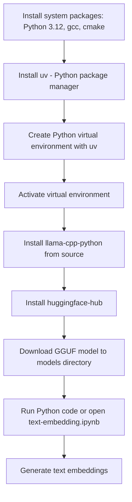

# Generate Text Embeddings with Llama.cpp on Red Hat Linux (from Source)

This project demonstrates how to set up `llama-cpp-python` on **Red Hat Linux 9.4**, build it from source, and generate vector embeddings using a quantized GGUF model. A Jupyter notebook (`text-embedding.ipynb`) is included to walk you through embedding generation.

---

## 🔧 Quick Start

### Step 1 – Run Setup Script

```bash
./setup.sh
````

* Installs system packages
* Creates Python 3.12 virtual environment using [`uv`](https://github.com/astral-sh/uv)
* Installs dependencies
* Downloads IBM’s Granite embedding model (GGUF)

### Step 2 – Configure VS Code Interpreter

```bash
./configure-vscode.sh
```

* Sets `.venv` as the default Python interpreter for your VS Code project and notebook

### Step 3 – Run Notebook

Open `text-embedding.ipynb` in VS Code and run the cells to see embeddings in action.

> ✅ You can stop here. The rest of the README explains each step in detail.

---

## Notebook Summary

**Notebook:** `text-embedding.ipynb`
What it does:

* Loads the IBM Granite text embedding model (quantized GGUF format)
* Converts example text into vector embeddings
* Displays the first few numbers of each embedding

You can replace the model with any compatible GGUF model from Hugging Face.
See: [Select and Download a GGUF Model](https://shaikhonai.substack.com/i/162148895/select-and-download-a-gguf-model)

---

## Tested On

* **OS**: Red Hat Enterprise Linux 9.4
* **Python**: 3.12
* **Hardware**: CPU-only (no CUDA/GPU required)

---

## Workflow Overview



---

## Manual Installation (Step-by-Step)

### 1. Enable CodeReady Builder (if not already enabled)

```bash
sudo subscription-manager repos --enable codeready-builder-for-rhel-9-$(arch)-rpms
```

### 2. Install System Packages

```bash
sudo dnf install -y \
    python3.12 \
    python3.12-devel \
    gcc-c++ \
    make \
    cmake \
    libcurl-devel \
    wget
```

### 3. Install `uv` Python Package Manager

```bash
curl -LsSf https://astral.sh/uv/install.sh | sh
export PATH="$HOME/.local/bin:$PATH"
```

### 4. Create and Activate Virtual Environment

```bash
uv venv --python $(which python3.12)
source .venv/bin/activate
```

### 5. Install Python Packages

```bash
export LLAMA_CPP_CMAKE_ARGS="-DLLAMA_NATIVE=ON"
uv pip install llama-cpp-python --no-binary :all:
uv pip install huggingface-hub
```

If you have a `requirements.txt`, run:

```bash
uv pip install -r requirements.txt
```

### 6. Download GGUF Embedding Model

```bash
mkdir -p models
cd models

wget -O granite-embedding-30m-english-Q6_K.gguf \
  https://huggingface.co/lmstudio-community/granite-embedding-30m-english-GGUF/resolve/main/granite-embedding-30m-english-Q6_K.gguf

cd ..
```

---

## Sample Python Usage

```python
from llama_cpp import Llama

embedding_model = Llama(
    model_path="models/granite-embedding-30m-english-Q6_K.gguf",
    embedding=True,
    verbose=False
)

text = "Paris is known for the Eiffel Tower."
embedding = embedding_model.create_embedding(text)
vector = embedding['data'][0]['embedding']
print(vector[:12], "...")
```

---

## Licensing

* IBM’s [Granite embedding model](https://huggingface.co/lmstudio-community/granite-embedding-30m-english-GGUF) is publicly available under a permissive license
* `llama-cpp-python` is MIT-licensed

---

## Resources

* [`llama-cpp-python` GitHub](https://github.com/abetlen/llama-cpp-python)
* [GGUF Model Format](https://github.com/ggerganov/llama.cpp/blob/master/docs/gguf.md)
* [GGUF Model Download Guide](https://shaikhonai.substack.com/i/162148895/select-and-download-a-gguf-model)